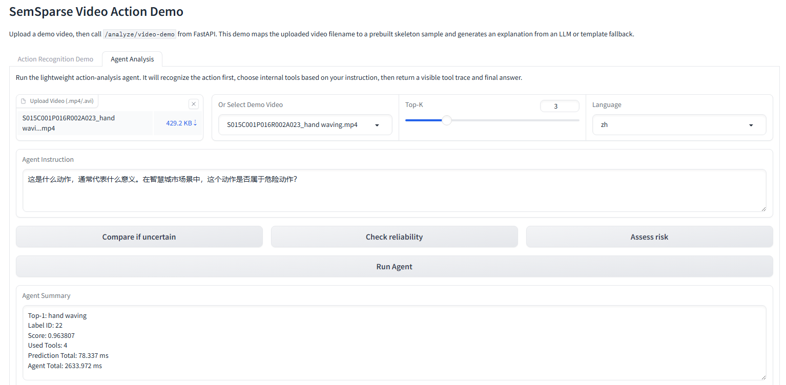
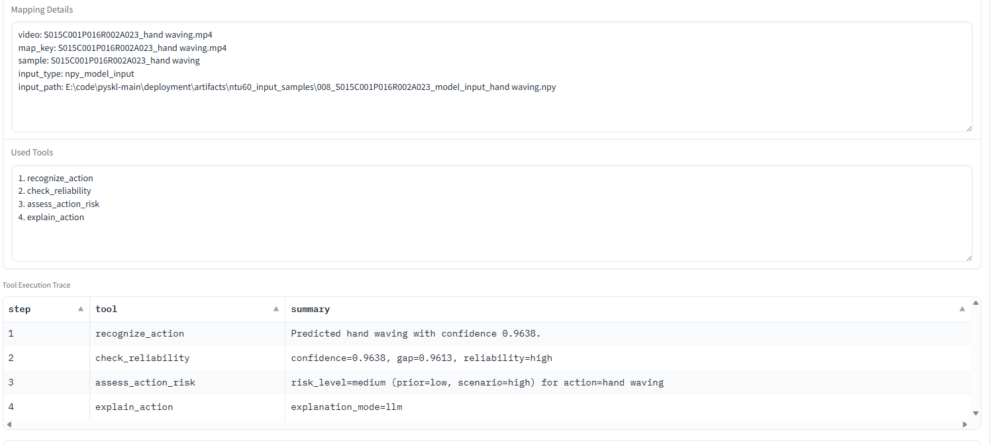
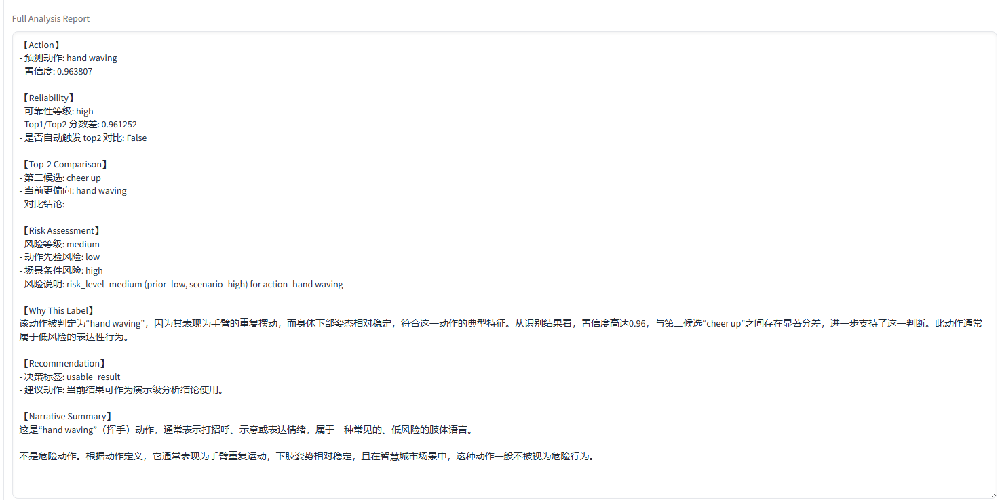

# SkeletonAction-Agent-Demo

`SkeletonAction-Agent-Demo` is a standalone deployment project for skeleton-based human action recognition, LLM explanation, follow-up QA, and lightweight agent-based action analysis.

Compared with the previous `recognition + explanation + QA` version, the current project adds a domain-specific agent layer that can plan tool usage, run multiple analysis steps, and return a visible tool trace.

It combines:

- `ONNX Runtime` for skeleton action recognition inference
- `FastAPI` for prediction, explanation, QA, and agent APIs
- `Gradio` for an interactive two-tab demo UI
- `Qwen / OpenAI-compatible API` for explanation and answer synthesis
- a lightweight action-analysis orchestrator for tool-augmented reasoning

The current demo still uses uploaded video as the interaction entry, then maps the filename to a prebuilt skeleton sample and runs recognition on structured skeleton input.

## Project Highlights

- Skeleton-based action recognition served through `FastAPI + ONNX Runtime`
- Video upload demo with `Gradio`
- `Top-1`, confidence score, and `Top-K` result display
- LLM-generated explanation grounded on prediction results
- Follow-up QA for result interpretation
- Lightweight agent workflow with visible planning and tool execution trace
- Automatic reliability check and optional top-2 comparison
- Scenario-aware risk assessment for action analysis
- Template fallback when the LLM API is unavailable

## What's New in This Version

This upgraded version is no longer just an LLM wrapper around predictions. It now includes a lightweight action-analysis agent that can:

1. recognize the action from the mapped skeleton sample
2. inspect confidence and `Top-K` candidates
3. decide whether extra tools are needed
4. compare candidate actions when uncertainty is high
5. assess action risk under a user-provided scenario
6. generate a final analysis report with tool trace

Current built-in agent tools:

- `recognize_action`
- `check_reliability`
- `compare_topk_actions`
- `assess_action_risk`
- `explain_action`

## Screenshots

### 1. Recognition Demo

Shows the standard action-recognition workflow with prediction summary, `Top-K` results, and explanation output.


### 2. Explanation View

Highlights how the system turns prediction evidence into a grounded natural-language explanation.


### 3. Follow-up QA

Shows how users can ask result-grounded follow-up questions after the initial prediction.


### 4. Agent Analysis Overview

Shows the lightweight action-analysis agent UI with instruction input, demo video selection, and analysis outputs.



### 5. Tool Trace

Shows which tools were selected and how the agent executed them step by step.



### 6. Final Analysis Report

Shows the decision panel and synthesized final report generated from the agent tool outputs.



## Result Showcase

Typical demo output now includes:

- uploaded video filename
- mapped skeleton sample path
- predicted action label
- confidence score
- top-k candidate classes
- explanation text
- follow-up QA answer
- used agent tools
- tool execution trace
- final analysis report

Example interaction flow:

1. Upload or choose `S009C001P008R002A001_drink water.mp4`
2. Backend maps it to the corresponding skeleton sample
3. Model predicts the action and produces `Top-K`
4. The agent checks reliability
5. If needed, the agent compares top candidates or assesses risk
6. The LLM synthesizes the final answer from tool outputs

## System Overview

```text
Video upload or demo selection
  -> Gradio frontend
  -> FastAPI /analyze/video-demo or /agent/analyze-video
  -> filename-based mapping to skeleton sample
  -> ONNX Runtime prediction
  -> agent tool orchestration
  -> Qwen / compatible LLM explanation or answer synthesis
  -> prediction + explanation + QA + analysis report
```

## Agent Workflow

```text
User instruction
  -> ActionAgentOrchestrator
  -> recognize_action
  -> check_reliability
  -> optional compare_topk_actions
  -> optional assess_action_risk
  -> explain_action
  -> final report + narrative answer + tool trace
```

The current orchestrator is lightweight and domain-specific. It is designed to make tool usage visible and stable for demo and resume presentation, rather than pretending to be a fully autonomous general-purpose agent.

## Project Structure

```text
deployment/
  artifacts/
    input_video/
    ntu60_input_samples/
    sem_sparse_ntu60_xview_joint.onnx
    video_demo_map.json
  fastapi/
    app.py
    llm.py
    prompt_builder.py
    action_knowledge.py
    preprocess.py
    runtime.py
    schemas.py
    video_mapper.py
    agent_tools.py
    agent_schemas.py
    agent_orchestrator.py
    requirements-fastapi.txt
  gradio/
    app.py
    client.py
    README.md
    requirements-gradio.txt
  AGENT_ENGINEERING_GUIDE.md
  onnx/
    export_sem_sparse_onnx.py
    verify_onnx_consistency.py
    prepare_ntu60_input_samples.py
    run_onnx_from_samples.py
```

## Demo UI

The Gradio app contains two tabs:

- `Action Recognition Demo`
  - upload video
  - run prediction
  - inspect explanation
  - ask follow-up questions
- `Agent Analysis`
  - upload video or choose a built-in demo sample
  - provide a natural-language instruction
  - inspect used tools, tool trace, decision panel, and final report

Recommended agent instructions:

- `Analyze this video. If the result is uncertain, compare the top two candidate actions.`
- `Explain the action and judge whether the prediction is reliable.`
- `In a public safety scenario, assess whether this action may be risky.`

## Demo Workflow

### Recognition mode

1. User uploads a demo video.
2. Backend matches the uploaded filename against `artifacts/video_demo_map.json`.
3. The matched skeleton sample is loaded from `artifacts/ntu60_input_samples/`.
4. The ONNX model produces action recognition scores.
5. The backend sends prediction evidence to the LLM.
6. The frontend displays prediction, confidence, explanation, and QA results.

### Agent mode

1. User uploads a video or selects a demo video.
2. User enters an analysis instruction.
3. The agent runs recognition first.
4. The agent always checks reliability.
5. The agent conditionally runs comparison or risk-assessment tools.
6. The backend returns `used_tools`, `tool_results`, `analysis_report`, and `final_answer`.

## Requirements

- Python `3.9` recommended
- `onnxruntime`
- `fastapi`
- `uvicorn`
- `gradio==3.50.2`
- `requests`

Install backend dependencies:

```powershell
python -m pip install -r deployment/fastapi/requirements-fastapi.txt
```

Install frontend dependencies:

```powershell
python -m pip install -r deployment/gradio/requirements-gradio.txt
```

If your environment already has package conflicts around `gradio`, `requests`, or `urllib3`, use:

```powershell
python -m pip uninstall -y gradio gradio-client
python -m pip install "requests==2.28.2" "urllib3<1.27"
python -m pip install -r deployment/gradio/requirements-gradio.txt
```

## LLM Configuration

This project supports `Qwen` or any `OpenAI-compatible` chat completion API.

Create a local config file:

- `deployment/fastapi/llm.local.json`

Example:

```json
{
  "enabled": true,
  "api_base": "https://dashscope.aliyuncs.com/compatible-mode/v1",
  "api_key": "replace_with_your_real_api_key",
  "model": "qwen-turbo",
  "timeout": 30
}
```

Notes:

- `llm.local.json` is intended for local use and should not be committed.
- If the LLM config is missing or invalid, the system falls back to template explanation.

## Run the Backend

```powershell
python -m uvicorn deployment.fastapi.app:app --host 127.0.0.1 --port 8000
```

Open:

- `http://127.0.0.1:8000/docs`
- `http://127.0.0.1:8000/health`

Useful health fields:

- `onnx_size_mb`
- `video_demo_map_ready`
- `video_demo_map_count`
- `video_demo_unique_samples`
- `video_demo_mapped_videos`
- `preprocess_backend`
- `llm_ready`
- `llm_local_config_loaded`
- `llm_local_config_error`

## Run the Frontend

In another terminal:

```powershell
python -m deployment.gradio.app
```

Open:

- `http://127.0.0.1:7860`

## Current Demo Samples

The current mapping file is:

- `deployment/artifacts/video_demo_map.json`

Configured demo videos include:

- `S008C001P015R001A022_cheer up.mp4`
- `S007C001P026R002A008_sitting down.mp4`
- `S009C001P008R002A001_drink water.mp4`
- `S004C001P020R001A007_throw.mp4`
- `S015C001P016R002A023_hand waving.mp4`

## API Endpoints

Main endpoints:

- `GET /health`
- `POST /predict/npy`
- `POST /predict/json`
- `POST /predict/video-demo`
- `POST /analyze/video-demo`
- `POST /explain`
- `POST /qa`
- `POST /agent/run-tool`
- `POST /agent/analyze-video`

Recommended demo endpoints:

- `POST /analyze/video-demo`
- `POST /agent/analyze-video`

`/analyze/video-demo` returns:

- mapping information
- prediction results
- explanation text

`/agent/analyze-video` returns:

- `used_tools`
- `plan`
- `tool_results`
- `analysis_report`
- `final_answer`
- prediction and mapping details
- timing metrics

## What This Project Is

This is a complete deployment and demo project for:

- skeleton-based action recognition
- ONNX model serving with FastAPI
- LLM-based explanation and QA
- lightweight tool-augmented agent orchestration
- interactive Gradio visualization and analysis demo

## What This Project Is Not

This repository does **not** currently do end-to-end RGB video understanding.

Important boundary:

- the user uploads a video for interaction
- the backend currently uses filename-to-skeleton mapping
- the recognition model works on prebuilt skeleton inputs
- the agent reasons over prediction outputs and tool results
- the LLM explains model outputs rather than directly understanding raw video pixels

This distinction should be stated clearly in demos, README text, and resume descriptions.

## Suggested Resume Description

Built a lightweight action-analysis agent on top of an `ONNX Runtime` skeleton action recognition service. The system exposes prediction, explanation, QA, and tool-oriented agent APIs through `FastAPI`, and provides a two-tab `Gradio` demo with visible tool traces, reliability checks, candidate comparison, and scenario-based risk assessment.

## Future Improvements

- support automatic skeleton extraction from arbitrary RGB video
- replace rule-based planning with more flexible tool selection when stability is acceptable
- add `/agent/plan` style debug view if needed for development screenshots
- expand demo sample coverage
- improve multilingual prompts and report formatting
- cache explanation and agent outputs for repeated demos
