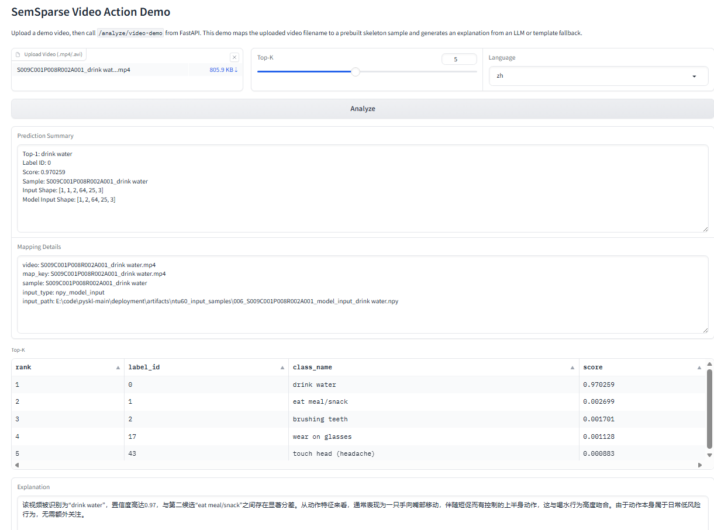
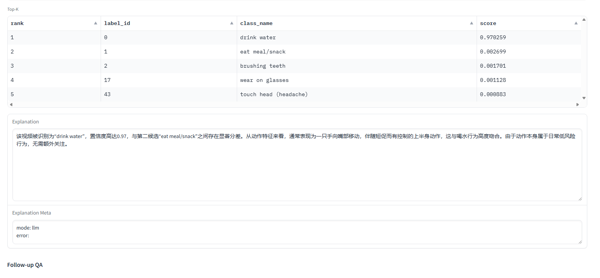
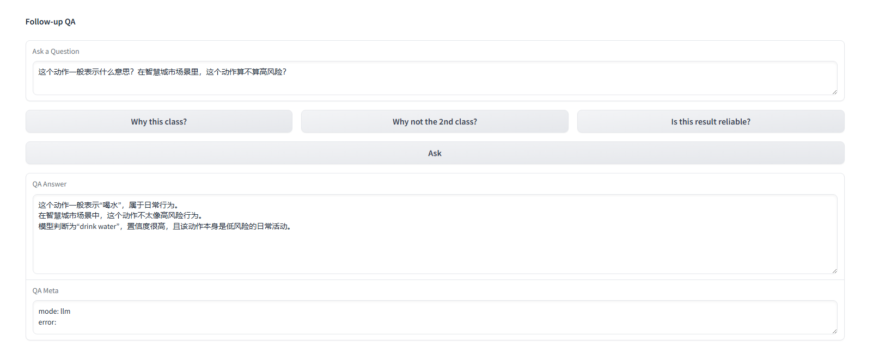

# SkeletonAction-LLM-Demo

`SkeletonAction-LLM-Demo` is a standalone deployment project for skeleton-based human action recognition with LLM-powered explanation and follow-up QA.

It combines:

- `ONNX Runtime` for action recognition inference
- `FastAPI` for prediction, explanation, and QA APIs
- `Gradio` for an interactive demo UI
- `Qwen / OpenAI-compatible API` for natural language explanation

The current demo uses uploaded video as the interaction entry, then maps the filename to a prebuilt skeleton sample and runs recognition on structured skeleton input.

## Project Highlights

- Skeleton-based action recognition served through `FastAPI + ONNX Runtime`
- Video upload demo with `Gradio`
- `Top-1`, confidence score, and `Top-K` result display
- LLM-generated explanation grounded on prediction results
- Follow-up QA such as:
  - why this action was predicted
  - why not another candidate class
  - whether the result looks reliable
- Template fallback when the LLM API is unavailable

## Screenshots

```markdown



```

## Result Showcase

Typical demo output includes:

- uploaded video filename
- mapped skeleton sample path
- predicted action label
- confidence score
- top-k candidate classes
- natural language explanation
- follow-up QA answer

Example interaction flow:

1. Upload `S009C001P008R002A001_drink water.mp4`
2. Backend maps it to the corresponding skeleton sample
3. Model predicts `drink water`
4. LLM explains why the prediction is plausible
5. User asks a follow-up question such as:
   - `Why not the 2nd class?`
   - `Is this result reliable?`
   - `What does this action usually imply?`

## Deployment Metrics (Current Run)

The following values are measured from your current local run (`/health` + one `/analyze/video-demo` response):

- ONNX model size: `5.9 MB`
- Runtime provider: `CPUExecutionProvider`
- Label count: `120`
- Demo mapping entries: `10`
- Unique demo samples: `5`
- Mapped demo videos: `5`
- LLM status: `enabled=true`, `ready=true`, `local_config_loaded=true`

Single-request latency snapshot (`batch_size=1`, with LLM explanation):

- `onnx_inference_ms`: `72.675`
- `mapping_lookup_ms`: `0.172`
- `sample_load_preprocess_ms`: `0.458`
- `prediction_total_ms`: `73.351`
- `llm_explanation_ms`: `1032.03`
- `api_total_ms`: `1105.397`

Note: these latency numbers are a local single-run snapshot and will vary by machine load, model provider, and network latency to the LLM endpoint.

## System Overview

```text
Video upload
  -> Gradio frontend
  -> FastAPI /analyze/video-demo
  -> filename-based mapping to skeleton sample
  -> ONNX Runtime prediction
  -> Qwen / compatible LLM explanation
  -> prediction + explanation + QA response
```

## Project Structure

```text
deployment/
  artifacts/
    input_video/
    ntu60_input_samples/
    sem_sparse_ntu60_xview_joint.onnx
    video_demo_map.json
  fastapi/
    app.py
    llm.py
    prompt_builder.py
    action_knowledge.py
    preprocess.py
    runtime.py
    schemas.py
    video_mapper.py
    requirements-fastapi.txt
  gradio/
    app.py
    client.py
    requirements-gradio.txt
  onnx/
    export_sem_sparse_onnx.py
    verify_onnx_consistency.py
    prepare_ntu60_input_samples.py
    run_onnx_from_samples.py
```

## Demo Workflow

1. User uploads a demo video.
2. Backend matches the uploaded filename against `artifacts/video_demo_map.json`.
3. The matched skeleton sample is loaded from `artifacts/ntu60_input_samples/`.
4. The ONNX model produces action recognition scores.
5. The backend sends prediction evidence to the LLM.
6. The frontend displays prediction, confidence, explanation, and QA results.

## Requirements

- Python `3.9` recommended
- `onnxruntime`
- `fastapi`
- `uvicorn`
- `gradio==3.50.2`
- `requests`

Install backend dependencies:

```powershell
python -m pip install -r deployment/fastapi/requirements-fastapi.txt
```

Install frontend dependencies:

```powershell
python -m pip install -r deployment/gradio/requirements-gradio.txt
```

If your environment already has package conflicts around `gradio`, `requests`, or `urllib3`, use:

```powershell
python -m pip uninstall -y gradio gradio-client
python -m pip install "requests==2.28.2" "urllib3<1.27"
python -m pip install -r deployment/gradio/requirements-gradio.txt
```

## LLM Configuration

This project supports `Qwen` or any `OpenAI-compatible` chat completion API.

Create a local config file:

- `deployment/fastapi/llm.local.json`

Example:

```json
{
  "enabled": true,
  "api_base": "https://dashscope.aliyuncs.com/compatible-mode/v1",
  "api_key": "replace_with_your_real_api_key",
  "model": "qwen-turbo",
  "timeout": 30
}
```

Notes:

- `llm.local.json` is intended for local use and should not be committed.
- If the LLM config is missing or invalid, the system falls back to template explanation.

## Run the Backend

```powershell
python -m uvicorn deployment.fastapi.app:app --host 127.0.0.1 --port 8000
```

Open:

- `http://127.0.0.1:8000/docs`
- `http://127.0.0.1:8000/health`

Useful health fields:

- `onnx_size_mb`
- `video_demo_map_ready`
- `video_demo_map_count`
- `video_demo_unique_samples`
- `video_demo_mapped_videos`
- `llm_ready`
- `llm_local_config_loaded`
- `llm_local_config_error`

## Run the Frontend

In another terminal:

```powershell
python -m deployment.gradio.app
```

Open:

- `http://127.0.0.1:7860`

## Current Demo Samples

The current mapping file is:

- `deployment/artifacts/video_demo_map.json`

Configured demo videos include:

- `S008C001P015R001A022_cheer up.mp4`
- `S007C001P026R002A008_sitting down.mp4`
- `S009C001P008R002A001_drink water.mp4`
- `S004C001P020R001A007_throw.mp4`
- `S015C001P016R002A023_hand waving.mp4`

## API Endpoints

Main endpoints:

- `GET /health`
- `POST /predict/npy`
- `POST /predict/json`
- `POST /predict/video-demo`
- `POST /analyze/video-demo`
- `POST /explain`
- `POST /qa`

Recommended demo endpoint:

- `POST /analyze/video-demo`

It returns:

- mapping information
- prediction results
- explanation text

## What This Project Is

This is a complete deployment and demo project for:

- skeleton-based action recognition
- model serving with FastAPI
- ONNX inference
- LLM-based explanation and QA
- interactive frontend demo

## What This Project Is Not

This repository does **not** currently do end-to-end RGB video understanding.

Important boundary:

- the user uploads a video for interaction
- the backend currently uses filename-to-skeleton mapping
- the recognition model works on prebuilt skeleton inputs
- the LLM explains model outputs rather than directly understanding raw video pixels

This distinction should be stated clearly in demos, README text, and resume descriptions.

## Suggested Resume Description

Built a skeleton-based human action recognition deployment system with `ONNX Runtime` and `FastAPI`, then extended it into an interactive video analysis demo with `Gradio` and `Qwen API`. The system supports action prediction, confidence ranking, natural language explanation, and follow-up QA through a complete `recognition + explanation + interaction` pipeline.

## Future Improvements

- support automatic skeleton extraction from arbitrary RGB video
- expand demo sample coverage
- improve action knowledge grounding for more classes
- cache explanation results for repeated demos
- add screenshot and video assets for project showcase
